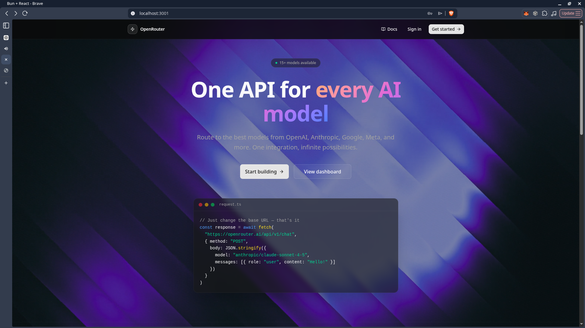
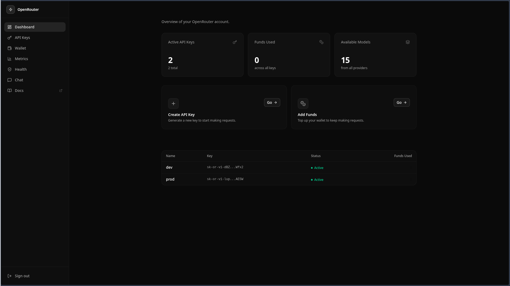
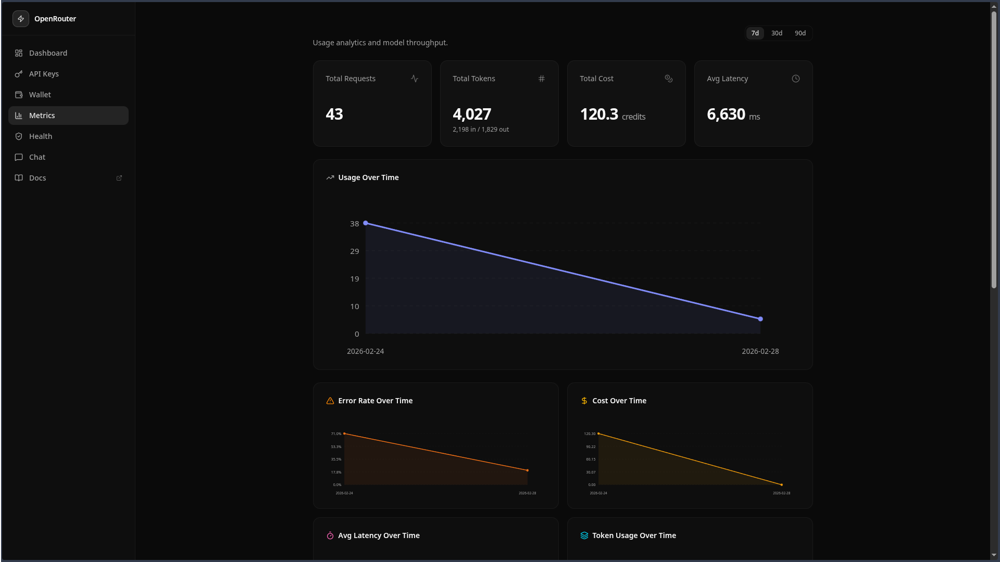
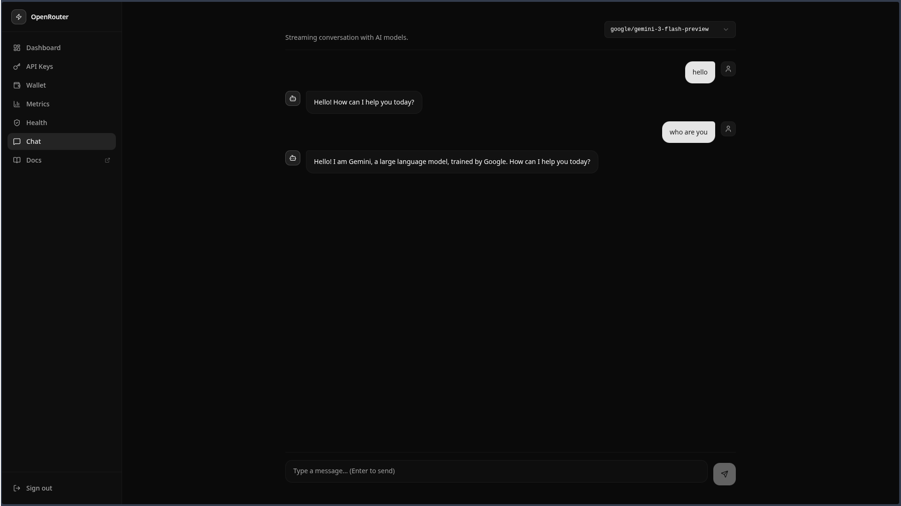
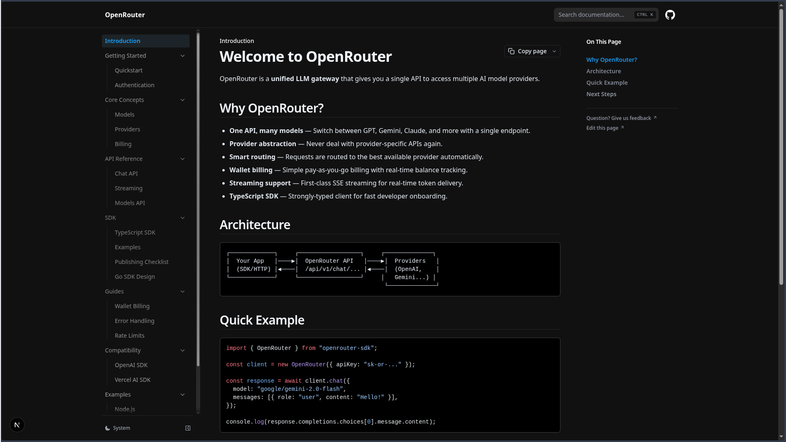

# 🚀 OpenRouter — Multi-Provider LLM Gateway Platform

OpenRouter is a production-grade, multi-provider LLM gateway that routes requests across different AI providers (OpenAI, Gemini, Claude, etc.) through a unified API.

---

## 📸 Application Screenshots

Here are some key screenshots from the Voting DApp:

  
*Home Page*

  
*Dasboard with APIs*

  
*Metrics to show usage*

  
*Chat with models*

  
*Docs of our site*

---

It includes:

- 🔁 Smart multi-provider routing
- 💰 Wallet-based billing system
- 📊 Usage metrics & observability
- 📡 Streaming (SSE) support
- 🔌 OpenAI-compatible API
- 🧠 Conversation persistence
- 🧰 TypeScript SDK
- 📚 Developer docs + Playground
- 🛠 Admin provider health dashboard
- ⚡ Caching for performance optimization

---

# ✨ Why OpenRouter?

Instead of integrating separately with multiple AI providers, OpenRouter gives you:

- A **single unified API**
- Automatic provider routing
- Usage tracking & billing
- OpenAI protocol compatibility
- Production-ready observability

---

# 🏗 Architecture Overview

Client App
↓
OpenRouter Gateway
↓
Provider Router
↓
OpenAI / Gemini / Claude / etc.

The gateway abstracts:

- Authentication
- Wallet deduction
- Metrics logging
- Streaming formatting
- Error normalization

---

# 🧩 Core Features

## 1️⃣ Multi-Provider Routing

- Route requests to OpenAI, Gemini, Claude
- Provider mapping via DB
- Automatic fail-safe logic (extensible)
- Cost-based routing ready

---

## 2️⃣ OpenAI-Compatible API

Supports: POST /v1/chat/completions

Fully compatible with:

- OpenAI SDK
- Vercel AI SDK
- LangChain OpenAI wrapper
- Any OpenAI-compatible client

Example:

```ts
import OpenAI from "openai";

const client = new OpenAI({
  apiKey: "YOUR_KEY",
  baseURL: "http://localhost:4000/v1"
});

## 🚀 Core Features

### 3️⃣ Streaming Support (SSE)

- Real-time token streaming  
- OpenAI-compatible chunk format  
- `[DONE]` termination event  
- Works with async iterators  

---

### 4️⃣ Wallet-Based Billing

Replaces credit system with real wallet balance.

**Features:**
- Real currency wallet
- Atomic balance deduction
- Transaction logging
- Negative balance protection
- Works for streaming & non-streaming

**Tables:**
- `User (walletBalance)`
- `WalletTransaction`
- `UsageMetric`

---

### 5️⃣ Metrics & Observability

Track:
- Requests
- Tokens
- Cost (model/provider)
- Latency
- Error rate
- Throughput (req/min)
- P95 latency
- Provider health

Optimized via:
- Aggregation queries
- TTL caching
- Indexed DB queries

---

### 6️⃣ Conversation Persistence

ChatGPT-style history:

- `Conversations` table
- `Messages` table
- Auto-generated titles
- Universal model-agnostic history
- Reloadable threads

---

### 7️⃣ Caching Layer

Performance optimization using:

- Redis (if available)
- In-memory fallback
- TTL-based caching

Cached endpoints:
- `/models`
- metrics
- provider health
- usage aggregations

---

### 8️⃣ Admin Provider Health Dashboard

Operator visibility into:

- Provider volume
- Error rate
- Avg latency
- Health status (Healthy / Degraded / Down)
- Routing performance

---

### 9️⃣ Developer Playground

Interactive testing inside docs:

- Paste API key
- Select model
- Streaming responses
- No SDK required

---

### 🔟 TypeScript SDK

Located at: packages/sdk-ts


**Usage:**

```ts
import { OpenRouter } from "openrouter-sdk";

const client = new OpenRouter({ apiKey: "YOUR_KEY" });

const res = await client.chat({
  model: "openai/gpt-3.5-turbo",
  messages: [{ role: "user", content: "Hello!" }]
});
```

## 📁 Project Structure


openrouter/
├── apps/
│ ├── api-backend/ # Public API layer (if applicable)
│ ├── primary-backend/ # Core LLM gateway (routing, billing, streaming)
│ ├── dashboard-frontend/ # User dashboard (chat, metrics, wallet, admin)
│ └── docs/ # Developer documentation + Playground
│
├── packages/
│ ├── cache/
│ ├── db/ 
│ ├── sdk-ts/ 
│ ├── ui/
│ ├── eslint-config/
│ └── typescript-config/ 
│
├── screenshots/ 
│
├── check_balances.ts 
├── check_providers.ts
├── get_keys.ts


# 🛠 Tech Stack

| Layer | Technologies |
|-------|-------------|
| **Backend** | Bun · Elysia · Prisma · PostgreSQL · Redis (optional) |
| **Frontend** | React · TanStack Query · Tailwind · Framer Motion |
| **Docs** | Next.js · Nextra |
| **SDK** | TypeScript (zero runtime deps) |

---

# 🔐 Authentication

```http
Authorization: Bearer YOUR_API_KEY
```

API keys are generated via dashboard.

---

# 📡 API Endpoints

```
POST /v1/chat/completions
GET  /models
GET  /metrics/summary
GET  /conversations
```

---

# ⚡ Performance

- Indexed queries
- TTL caching
- SSE streaming
- Lazy-loaded charts
- Optimized aggregations

---

# 🚀 Running Locally

**Install:**

```bash
bun install
```

**Backend:**

```bash
bun run dev
```

**Dashboard:**

```bash
bun run --filter dashboard-frontend dev
```

**Docs:**

```bash
bun run --filter docs dev
```


# Turborepo starter

This Turborepo starter is maintained by the Turborepo core team.

## Using this example

Run the following command:

```sh
npx create-turbo@latest
```

## What's inside?

This Turborepo includes the following packages/apps:

### Apps and Packages

- `docs`: a [Next.js](https://nextjs.org/) app
- `web`: another [Next.js](https://nextjs.org/) app
- `@repo/ui`: a stub React component library shared by both `web` and `docs` applications
- `@repo/eslint-config`: `eslint` configurations (includes `eslint-config-next` and `eslint-config-prettier`)
- `@repo/typescript-config`: `tsconfig.json`s used throughout the monorepo

Each package/app is 100% [TypeScript](https://www.typescriptlang.org/).

### Utilities

This Turborepo has some additional tools already setup for you:

- [TypeScript](https://www.typescriptlang.org/) for static type checking
- [ESLint](https://eslint.org/) for code linting
- [Prettier](https://prettier.io) for code formatting

### Build

To build all apps and packages, run the following command:

```
cd my-turborepo

# With [global `turbo`](https://turborepo.dev/docs/getting-started/installation#global-installation) installed (recommended)
turbo build

# Without [global `turbo`](https://turborepo.dev/docs/getting-started/installation#global-installation), use your package manager
npx turbo build
yarn dlx turbo build
pnpm exec turbo build
```

You can build a specific package by using a [filter](https://turborepo.dev/docs/crafting-your-repository/running-tasks#using-filters):

```
# With [global `turbo`](https://turborepo.dev/docs/getting-started/installation#global-installation) installed (recommended)
turbo build --filter=docs

# Without [global `turbo`](https://turborepo.dev/docs/getting-started/installation#global-installation), use your package manager
npx turbo build --filter=docs
yarn exec turbo build --filter=docs
pnpm exec turbo build --filter=docs
```

### Develop

To develop all apps and packages, run the following command:

```
cd my-turborepo

# With [global `turbo`](https://turborepo.dev/docs/getting-started/installation#global-installation) installed (recommended)
turbo dev

# Without [global `turbo`](https://turborepo.dev/docs/getting-started/installation#global-installation), use your package manager
npx turbo dev
yarn exec turbo dev
pnpm exec turbo dev
```

You can develop a specific package by using a [filter](https://turborepo.dev/docs/crafting-your-repository/running-tasks#using-filters):

```
# With [global `turbo`](https://turborepo.dev/docs/getting-started/installation#global-installation) installed (recommended)
turbo dev --filter=web

# Without [global `turbo`](https://turborepo.dev/docs/getting-started/installation#global-installation), use your package manager
npx turbo dev --filter=web
yarn exec turbo dev --filter=web
pnpm exec turbo dev --filter=web
```

### Remote Caching

> [!TIP]
> Vercel Remote Cache is free for all plans. Get started today at [vercel.com](https://vercel.com/signup?/signup?utm_source=remote-cache-sdk&utm_campaign=free_remote_cache).

Turborepo can use a technique known as [Remote Caching](https://turborepo.dev/docs/core-concepts/remote-caching) to share cache artifacts across machines, enabling you to share build caches with your team and CI/CD pipelines.

By default, Turborepo will cache locally. To enable Remote Caching you will need an account with Vercel. If you don't have an account you can [create one](https://vercel.com/signup?utm_source=turborepo-examples), then enter the following commands:

```
cd my-turborepo

# With [global `turbo`](https://turborepo.dev/docs/getting-started/installation#global-installation) installed (recommended)
turbo login

# Without [global `turbo`](https://turborepo.dev/docs/getting-started/installation#global-installation), use your package manager
npx turbo login
yarn exec turbo login
pnpm exec turbo login
```

This will authenticate the Turborepo CLI with your [Vercel account](https://vercel.com/docs/concepts/personal-accounts/overview).

Next, you can link your Turborepo to your Remote Cache by running the following command from the root of your Turborepo:

```
# With [global `turbo`](https://turborepo.dev/docs/getting-started/installation#global-installation) installed (recommended)
turbo link

# Without [global `turbo`](https://turborepo.dev/docs/getting-started/installation#global-installation), use your package manager
npx turbo link
yarn exec turbo link
pnpm exec turbo link
```

## Useful Links

Learn more about the power of Turborepo:

- [Tasks](https://turborepo.dev/docs/crafting-your-repository/running-tasks)
- [Caching](https://turborepo.dev/docs/crafting-your-repository/caching)
- [Remote Caching](https://turborepo.dev/docs/core-concepts/remote-caching)
- [Filtering](https://turborepo.dev/docs/crafting-your-repository/running-tasks#using-filters)
- [Configuration Options](https://turborepo.dev/docs/reference/configuration)
- [CLI Usage](https://turborepo.dev/docs/reference/command-line-reference)
